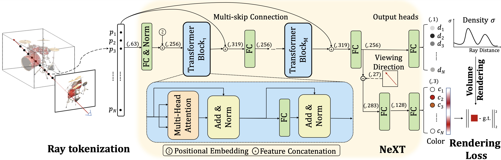

## NeXT
This repository contains the code release for NeXT: Towards High Quality Neural Radiance Fields via Multi-Skip Transformer.
This implementation is based on [JaxNeRF](https://github.com/google-research/google-research/tree/master/jaxnerf) and 
[Mip-NeRF](https://github.com/google/mipnerf). NeXT can be easily incorporated into NeRF and Mip-NeRF methods to serve as 
the query network, achieving higher quality rendering results.


## Abstract
Neural Radiance Fields (NeRF) methods show impressive performance for novel view synthesis by representing a scene via a neural network. However, most existing NeRF based methods, including its variants, treat each sample point individually as input, while ignoring
the inherent relationships between adjacent sample points from the corresponding rays, thus hindering the reconstruction
performance. To address this issue, we explore a brand new scheme, namely NeXT, introducing a multi-skip transformer to 
capture the rich relationships between various sample points in a ray-level query. Specifically, ray tokenization is 
proposed to represent each ray as a sequence of point embeddings which is taken as input of our proposed NeXT. 
In this way, relationships between sample points are captured via the built-in self-attention mechanism 
to promote the reconstruction. Besides, our proposed NeXT can be easily combined with other NeRF based methods to 
improve their rendering quality. Extensive experiments conducted on three datasets demonstrate that NeXT 
significantly outperforms all previous state-of-the-art work by a large margin. In particular, the proposed NeXT 
surpasses the strong NeRF baseline by 2.74 PSNR on Blender dataset.

## Installation
Following [JaxNeRF](https://github.com/google-research/google-research/tree/master/jaxnerf).

We recommend using [Anaconda](https://www.anaconda.com/products/individual) to set
up the environment. Run the following commands:

```
# Clone the repo
svn export https://github.com/google-research/google-research/trunk/jaxnerf
# Create a conda environment, note you can use python 3.6-3.8 as
# one of the dependencies (TensorFlow) hasn't supported python 3.9 yet.
conda create --name jaxnerf python=3.6.12; conda activate jaxnerf
# Prepare pip
conda install pip; pip install --upgrade pip
# Install requirements
pip install -r jaxnerf/requirements.txt
# [Optional] Install GPU and TPU support for Jax
# Remember to change cuda101 to your CUDA version, e.g. cuda110 for CUDA 11.0.
pip install --upgrade jax jaxlib==0.1.57+cuda101 -f https://storage.googleapis.com/jax-releases/jax_releases.html
```

Then, you'll need to download the datasets
from the [NeRF official Google Drive](https://drive.google.com/drive/folders/128yBriW1IG_3NJ5Rp7APSTZsJqdJdfc1).
Please download the `nerf_synthetic.zip` and unzip to `jaxnerf/data` and `mipnerf/data`.

### Generate multiscale dataset
You can generate the multiscale dataset by running the following command,
```
cd mipnerf
python scripts/convert_blender_data.py --blenderdir ./data/nerf_synthetic --outdir ./data/nerf_synthetic_multiscale
```

## Running

Example scripts for training NeXT on Blender and Multi-scale Bender dataset can be found in `jaxnerf/scripts` and `mipnerf/scrips`. 
You'll need to change the paths to point to wherever the datasets are located.

For training NeXT-S/NeXT-B/NeXT-L of one scene on Blender dataset, run the following scrips:
```
cd jaxnerf
# training
sh scripts/train_next_blender.sh chair next_s   # next_s/next_b/next_l
# evaluation
sh scripts/eval_next_blender.sh chair next_s   # next_s/next_b/next_l
```

For training NeXT-S/NeXT-B/NeXT-L of one scene on Multi-scale dataset, run the following scrips:
```
cd mipnerf
# training
sh scripts/train_next_multiblender.sh chair next_s   # next_s/next_b/next_l
# evaluation
sh scripts/eval_next_multiblender.sh chair next_s   # next_s/next_b/next_l
```

## Results
### Blender
|       | #Params |   Chair   |   Drums   |   Ficus   |   Hotdog  | Lego | Materials | Mic | Ship | Avg. |
|---------   |:-------:|:---------:|:---------:|:---------:|:---------:|:---------:|:---------:|:---------:|:---------:|:---------:|
| NeRF (JAX) | 1,191K|   34.06   |   25.13   |   30.48   |   36.87   | 33.33 | 29.94 | 34.66 | 28.77 | 31.66 |   
| NeXT-S | 1,232K | 33.75 | 25.34 | 32.62 | 37.42 | 34.52 | 32.09 | 33.74 | 29.25 | 32.34 |
| NeXT-B | 2,152K | 34.70 | 25.79 | 33.77 | 38.10 | 35.67 | 32.48 | 34.46 | 30.07 | 33.13 |
| NeXT-L | 4,062K | **36.05** | **26.49** | **35.67** | **38.46** | **37.39** | **34.16** | **35.96** | **30.73**| **34.40** |

### Multi-scale Blender
|       | #Params |   Full Res.   |   1/2 Res.   |   1/4 Res.   |   1/8 Res.  |
|---------   |:-------:|:---------:|:---------:|:---------:|:---------:|
| NeRF (JAX) | 1,191K|   31.20   |   30.65   |   26.25   |   22.53   |   
| Mip-NeRF   |612K| 32.63 | 34.34 | 35.47 | 35.60 | 
| NeXT-S | 616K | 32.18 | 34.32 | 36.43 | 37.57 |
| NeXT-B | 1,076K | 32.92 | 35.06 | 36.99 | 38.05 |
| NeXT-L | 2,031K | **34.38** | **36.47** | **38.19** | **39.29** |

## Acknowledgements
Thanks for the open-source [JaxNeRF](https://github.com/google-research/google-research/tree/master/jaxnerf)
and [Mip-NeRF](https://github.com/google/mipnerf).